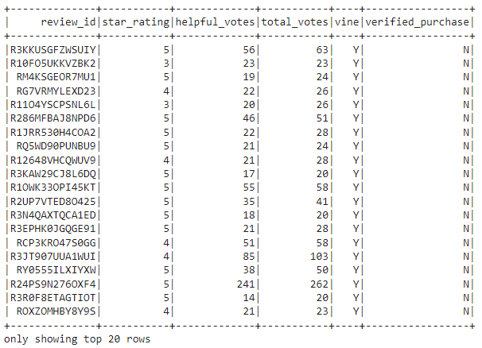
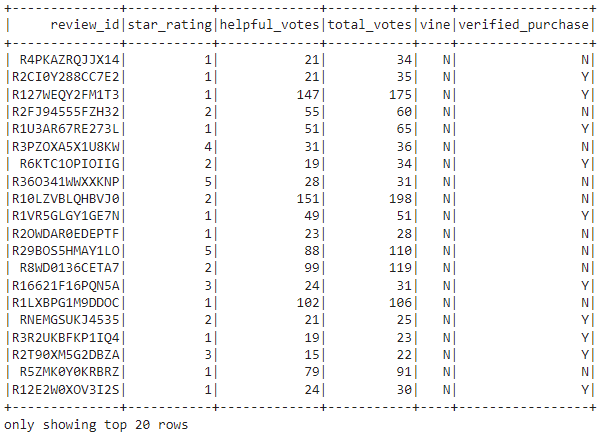

# Big Data

## Overview of the Analysis
The Vine program is a service that allows manufacturers and publishers to receive reviews for their products. Companies pay a small fee to Amazon and provide products to Amazon Vine members, who are then required to publish a review. The purpose of the analysis is to determine whether or not members of The Vine program have a higher likelihood of writing a five-star review; important information to have to determine the veracity of the Vine five-star reviews.  First, the ETL process is executed on the raw data set provided by Amazon, then an analysis is performed using Python/PySpark.  For the purposes of this analysis, video game product reviews have been included.

## Results
  
*Vine Participant Example*  

  
*Non-Vine Participant Data Example*  

* How many Vine reviews and non-Vine reviews were there?  
  * Total number of reviews in the paid Vine program: 94  
  * Total number of reviews in the unpaid program: 40471  

* How many Vine reviews were 5 stars? How many non-Vine reviews were 5 stars?  
  * Total number of 5-star reviews in the paid Vine program: 48
  * Total number of 5-star reviews in the unpaid program: 15663

* What percentage of Vine reviews were 5 stars? What percentage of non-Vine reviews were 5 stars?  
  * Percentage of 5-star reviews in the paid Vine program:  51.06 %
  * Percentage of 5-star reviews in the unpaid program:  38.7 %

### Summary  
It would appear that there is a positivity bias in reviews in the Vine program, possibly as a result of the participants knowing they are paid for their reviews.  Over 51.06% of the sampled data in the Vine provided the highest possible review, as apposed to 38.7% in the non-paid sample.

Considering that this data only reflects data surrounding video game products, results may be more accurate if the analysis was performed after an ETL process that would extract and join multiple data sets across multiple product categories to balance differing tastes, preferences, and behaviors among typical video game consumers and the buying population in general.  Furthermore, it would help remove uncertainty regarding whether or not sample data and analysis results are influenced by product type.

